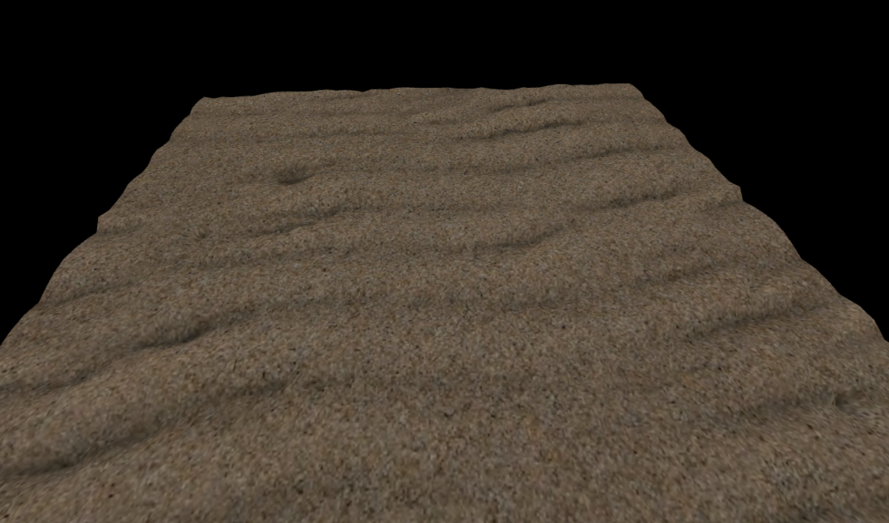
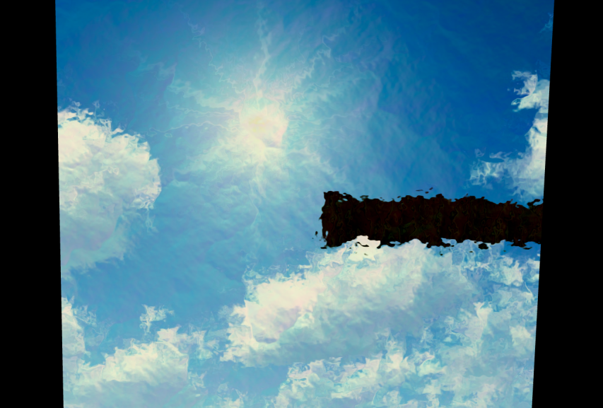
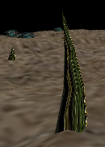
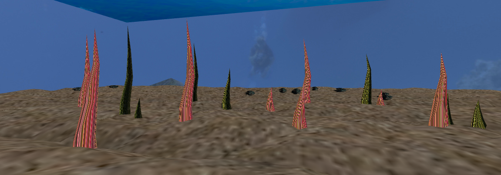

# CGRA 2020/2021

## Group T03G07
| Name             | Number    | E-Mail               |
| ---------------- | --------- | -------------------- |
| Ana Marques      | 201907565 | up201907565@fe.up.pt |
| Sofia Germer     | 201907461 | up201907461@fe.up.pt |

----
## Screenshots

### 1 - MyFish

### 2 - Sea Floor

### 2 - Nest - Pineapple

### 3 - Water Surface

### 4 - Rock and Rock sets

### 5 - Pillar Set

### 6 - Updated Sea Floor

### 6.3 - Fish catching Rocks

### 7.1 - Sea Weed

### 7.2 - My Animated Fish

