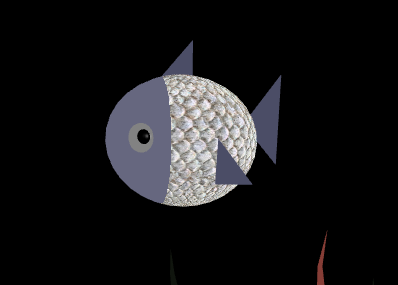
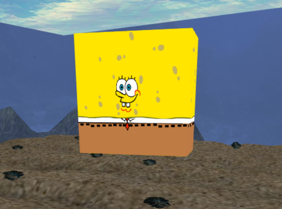
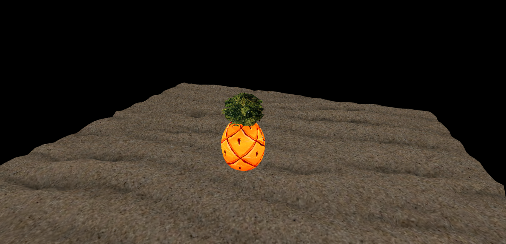
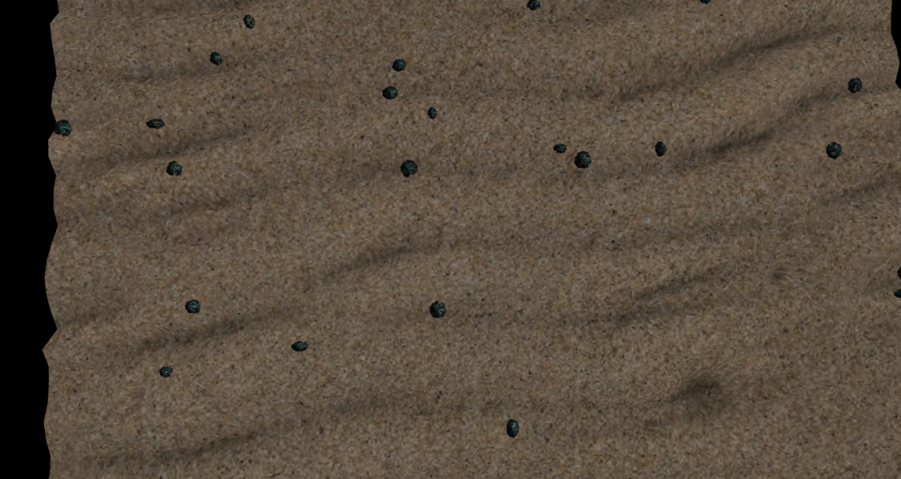
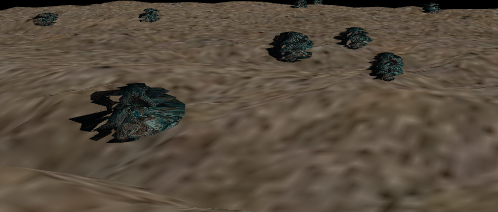
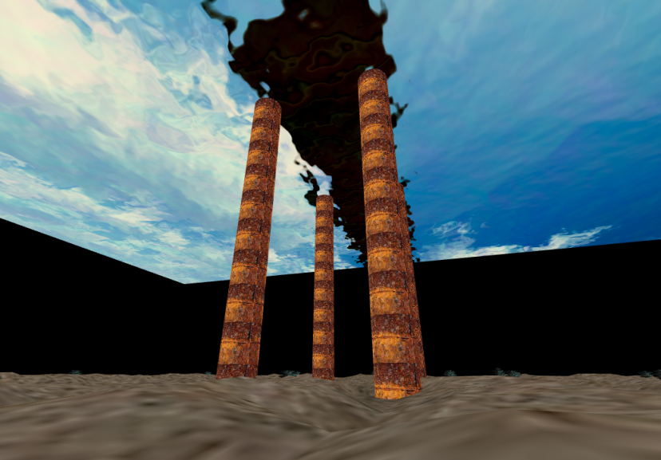
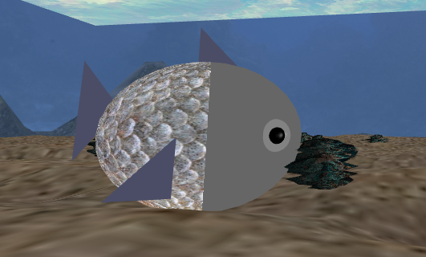
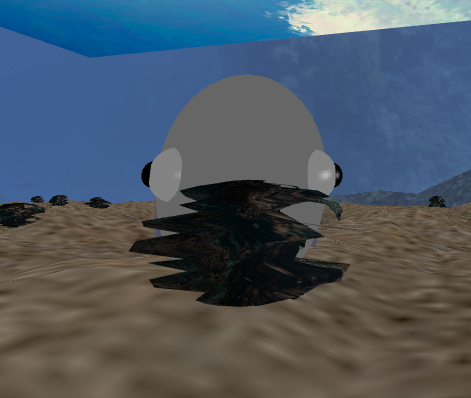
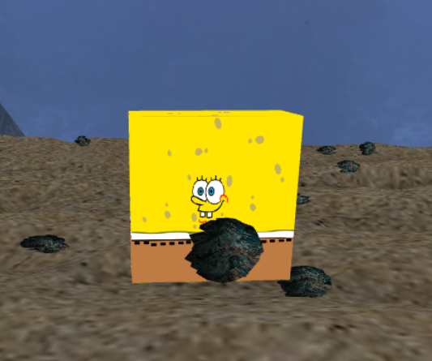
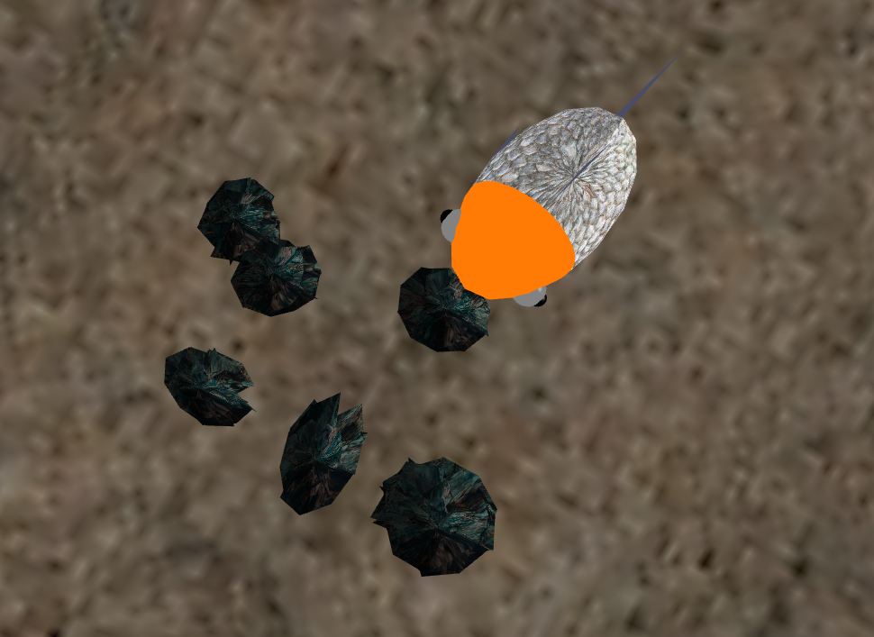

# CGRA 2020/2021

## Group T03G07
| Name             | Number    | E-Mail               |
| ---------------- | --------- | -------------------- |
| Ana Marques      | 201907565 | up201907565@fe.up.pt |
| Sofia Germer     | 201907461 | up201907461@fe.up.pt |

----
## Screenshots

### 1 - MyFish/MySpongeBob

### 2 - Sea Floor

### 2 - Nest - Pineapple

### 3 - Sea Water

### 4 - Rock and Rock sets

### 5 - Pillar Set

### 6.1 - Fish/SpongeBob catching Rocks

### 6.2 - Fish letting go Rocks

### 7.1 - Animated Sea Weed

### 7.2 - Animated Fish

